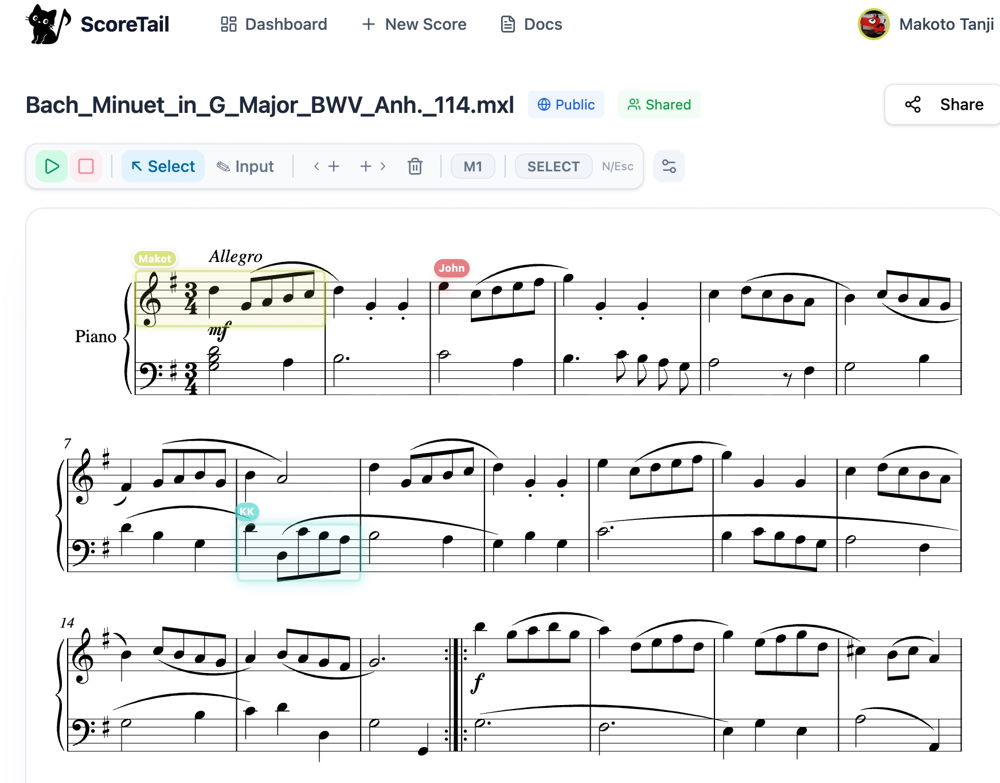

  

<h3 align="center">Online Collaborative Music Score Editor</h3>

  Play, annotate, and share sheet music together — right in your browser.

  <a href="https://scoretail.com">Website</a> ·
  <a href="https://scoretail.com/en/docs">Docs</a> ·
  <a href="https://github.com/YOUR_USERNAME/scoretail/issues">Bug Reports</a> ·
  <a href="https://github.com/YOUR_USERNAME/scoretail/issues">Feature Requests</a>

  
  
  

---

  

## What is ScoreTail?

ScoreTail is a web-based music score editor built for playing, learning, and creating music together.

Open a classic from our **public domain library**, add your own annotations, or start a fresh score and invite others to join in — all in real time, right in your browser. Whether you're rehearsing with a band, teaching a class, or just exploring music with friends, ScoreTail makes sheet music something you can share and enjoy together.

  

## Why ScoreTail?

| | ScoreTail | Traditional notation software |
|---|---|---|
| **Install** | None (browser) | Desktop install required |
| **Real-time collaboration** | ✅ Built-in | ❌ or limited |
| **Annotations** | ✅ Write directly on scores | ❌ |
| **Classic music library** | ✅ Public domain collection | ❌ |
| **Playback** | ✅ In-browser | ✅ |
| **MusicXML support** | ✅ | ✅ |
| **Works on any device** | ✅ | Desktop only |

## Features

**🎵 Classic Music Library**
- Browse and open public domain scores — Bach, Beethoven, Mozart, Chopin, and more
- Fork any score to create your own arrangement or study version
- Community-contributed library that keeps growing

**✏️ Annotations**
- Write notes, fingerings, bowings, and comments directly on the score
- Highlight passages, mark practice sections, and add reminders
- Each collaborator's annotations are visible in real time

**👥 Real-time Collaboration**
- Edit the same score simultaneously — powered by CRDT-based sync
- Share a view-only link or an editable link for collaborators
- No account required to try — just click "Try without signing up"

**🎧 Playback**
- Built-in audio playback with per-part volume control
- Solo or mute individual parts — perfect for practice
- Play from any position or selected region

**📝 Score Editing**
- Note input via keyboard shortcuts (A–G for pitch, 1–6 for duration) or mouse
- Multi-part / multi-staff scores
- Key signatures, time signatures, dynamics, articulations, ties, slurs

**📤 Import & Export**
- MusicXML import/export for interoperability with MuseScore, Sibelius, Dorico, etc.

## Tech Stack

ScoreTail is built with modern web technologies focused on performance and real-time collaboration:

| Layer | Technology |
|---|---|
| Real-time sync | [Yjs](https://yjs.dev/) (CRDT-based) |
| Backend & Auth | [Firebase](https://firebase.google.com/) (Firestore, Authentication) |
| Music rendering | [Verovio](https://www.verovio.org/) |
| MusicXML parsing | [musicxml-io](https://github.com/tan-z-tan/musicxml-io) |
| Audio playback | Web Audio API |
| Frontend | TypeScript, React |

## Getting Started

1. Go to [scoretail.com](https://scoretail.com)
2. Click **"Try without signing up"** or create an account
3. Create a new score or import a MusicXML file
4. Start composing ✍️

## Roadmap

ScoreTail is currently in **public beta**. Here's where we're headed:

- [x] Core score editing & playback
- [x] Real-time collaborative editing
- [x] 🔜 Chord symbols & lyrics
- [x] Annotations & markups on scores
- [x] Public domain classic music library
- [x] MusicXML import/export
- [ ] 🔜 Guitar tablature view
- [ ] 🔜 PDF export
- [ ] Richer annotation tools (drawing, highlighting)
- [ ] Score templates for common ensembles
- [ ] Expanded classic music library
- [ ] AI-assisted features

Have a suggestion? [Open an issue](https://github.com/YOUR_USERNAME/scoretail/issues) — we'd love to hear it.

## About This Repository

The source code for ScoreTail is not publicly available at this time. This repository is used for:

- 🐛 **Bug reports** — [Open an issue](https://github.com/YOUR_USERNAME/scoretail/issues)
- 💡 **Feature requests** — [Open an issue](https://github.com/YOUR_USERNAME/scoretail/issues)
- 📋 **Release notes** — [See releases](https://github.com/YOUR_USERNAME/scoretail/releases)
- 💬 **Discussion** — [Join the discussion](https://github.com/YOUR_USERNAME/scoretail/discussions)

## Contributing

While the source code is currently closed, there are several ways to contribute:

- Report bugs or suggest features via [Issues](https://github.com/YOUR_USERNAME/scoretail/issues)
- Join the conversation in [Discussions](https://github.com/YOUR_USERNAME/scoretail/discussions)
- Share ScoreTail with musicians, teachers, and students who might find it useful
- Star ⭐ this repo to help others discover the project

## Connect

- [https://scoretail.com](https://scoretail.com)
- [@scoretail](https://x.com/scoretail) on X
- Author [@tan_z_tan](https://x.com/tan_z_tan)

---

  Made with 🎵 for musicians everywhere

